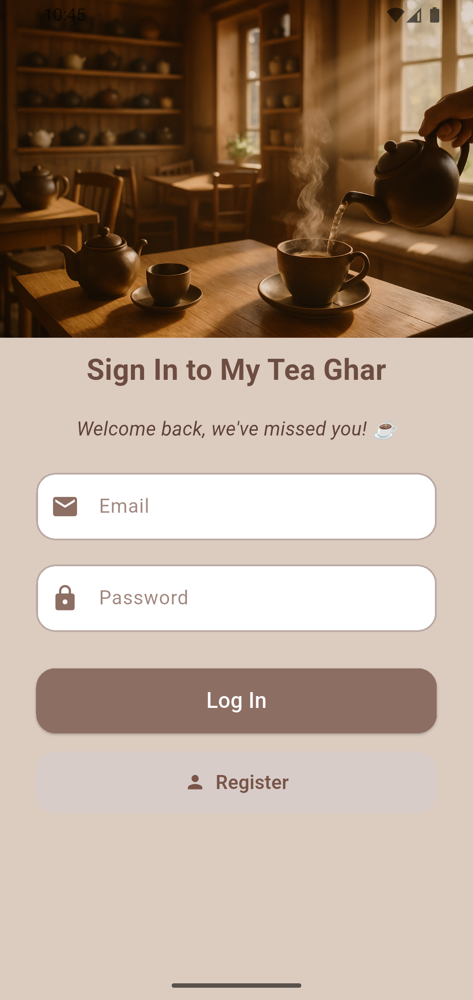
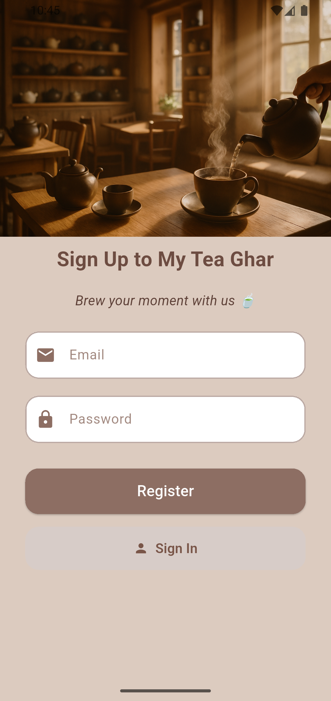
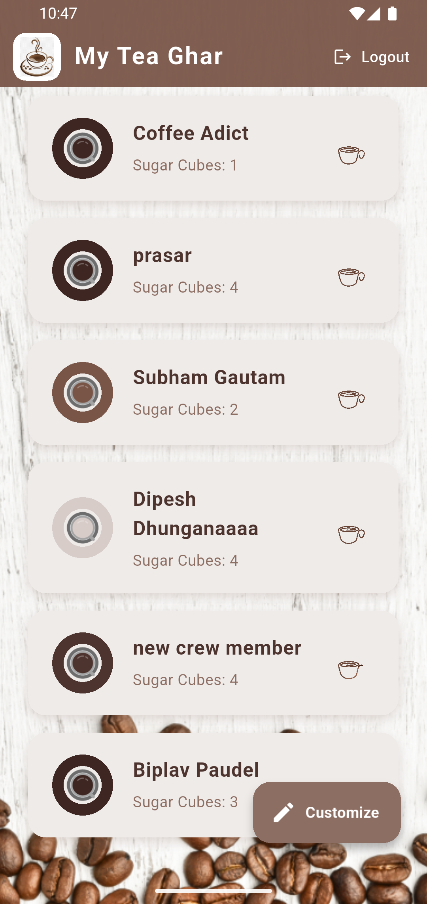
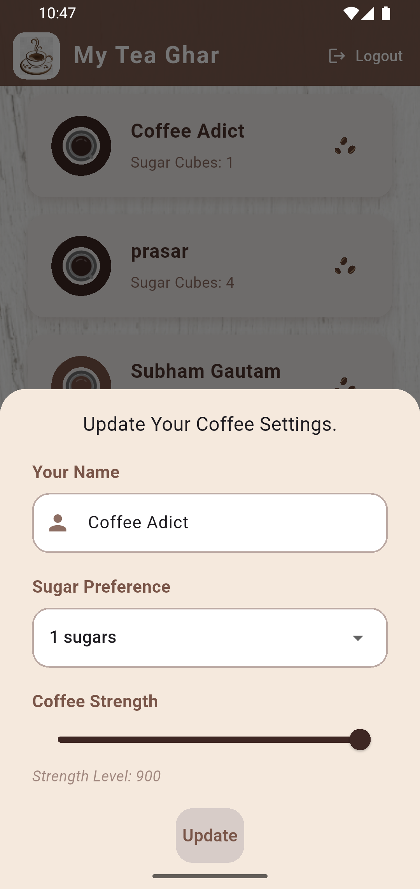

# ☕ My Tea Ghar

A minimalist Flutter app built while following [The Net Ninja's Flutter Firebase tutorial series](https://www.youtube.com/playlist?list=PL4cUxeGkcC9j--TKIdkb3ISfRbJeJYQwC). It demonstrates Firebase Authentication, Cloud Firestore, and state management using Provider.

---

## 🚀 Features

- 🔐 Firebase Authentication (Email & Password)
- ☁️ Realtime Firestore integration
- 🧠 State Management using Provider
- 🛠 Custom Brew Settings per user
- 📱 Clean UI built with Material Design

---

## 📸 Screenshots (Currently Working on it!)

> Add screenshots in `assets/screenshots/` and link them here:








---

## 🧰 Tech Stack

- **Flutter** (Dart)
- **Firebase Auth** & **Cloud Firestore**
- **Provider** for state management

---

## 🛠️ Getting Started

## 📁 Project Structure

lib/

├── main.dart              # App entry point

├── models/                # User and Brew models

├── screens/               # UI screens

├── services/              # Firebase Auth & Database services

├── shared/                # Common widgets and constants

└── widgets/               # Custom reusable widgets

## 🙏 Acknowledgements

This app was built by following the excellent **Flutter & Firebase App Build Tutorial** series by [The Net Ninja](https://www.youtube.com/playlist?list=PL4cUxeGkcC9j--TKIdkb3ISfRbJeJYQwC). Big thanks to Shaun for the well-structured and beginner-friendly content!

Additional thanks to:
- **Flutter** team for their amazing cross-platform framework
- **Firebase** team for providing powerful backend services

## 📄 License

This project is licensed under the [MIT License](LICENSE).


## 💬 Feedback or Contributions

Found a bug, have a suggestion, or want to contribute? Feel free to:

- ⭐ Star the repo to show your support
- 🐛 [Open an issue](https://github.com/iamdipesh18/my_tea_ghar/issues) for bugs or ideas
- 📥 Fork the repo and submit a pull request

I'd love to hear your thoughts and improvements to make this project even better!


### 1. Prerequisites

- Flutter SDK installed ([Installation Guide](https://flutter.dev/docs/get-started/install))
- Firebase account

### 2. Clone and Run

```bash
git clone https://github.com/iamdipesh18/my_tea_ghar.git
cd my_tea_ghar
flutter pub get
flutter run
